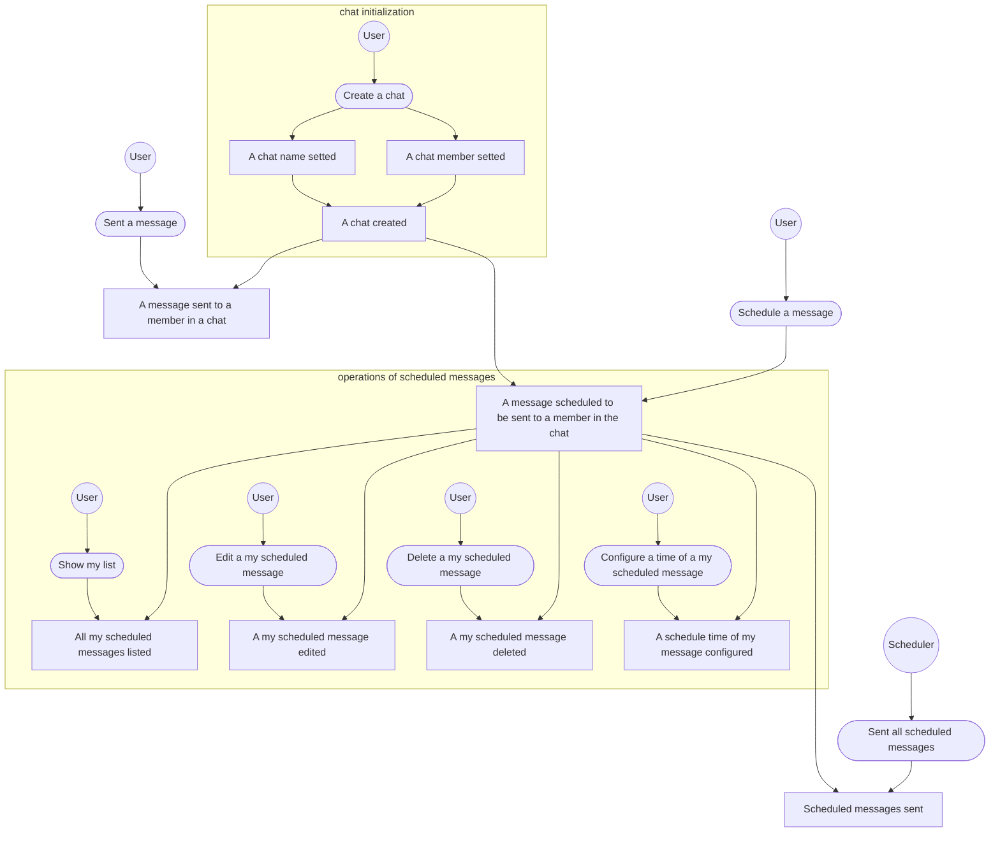

# cw-ddd-challenge
https://chatwork.connpass.com/event/263334/

# 問題
## 対象ドメイン
チャットにおけるメッセージの予約送信を、コミニュケーションの心理的障壁軽減のために、ソフトウェアで解決する

## アクター
ユーザー（社会人）

## ユースケース
- ユーザーは、【チャット】の【名前】、【所属メンバー】などを設定する
- ユーザーは、【チャット】の【所属メンバー】に【メッセージ】を送信する
  - ユーザーは、【メッセージ】をすぐに送信するか、【送信予定時刻】を設定するかを選択できる
    - 過去の時刻に【送信予定時刻】を設定することはできない
- ユーザーは、【送信予定のメッセージ】を全て確認できる
- ユーザーは、【送信予定のメッセージ】を編集・削除できる
- ユーザーは、【送信予定のメッセージ】の【送信予定時刻】を変更できる
  - 過去の時刻に【送信予定時刻】を設定することはできない
- 【スケジューラー】は、【送信予定のメッセージ】を送信する

# 設計
## EventStorming

